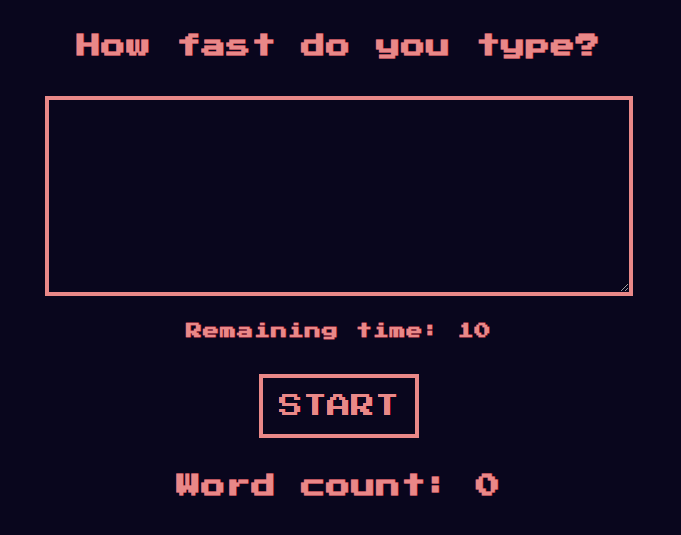

Speed typing game from Bob Ziroll's _Advanced React_ course on Scrimba.

Built with:

- React + hooks (useEffect, useState, useRef)
- CSS variables
- Flexbox
- Regex

After clicking the start button, users should be able to
type inside the textarea input, and see the word count after 10 seconds.

Live site: [https://double-vee.github.io/react-speed-typing-game](https://double-vee.github.io/react-speed-typing-game)

